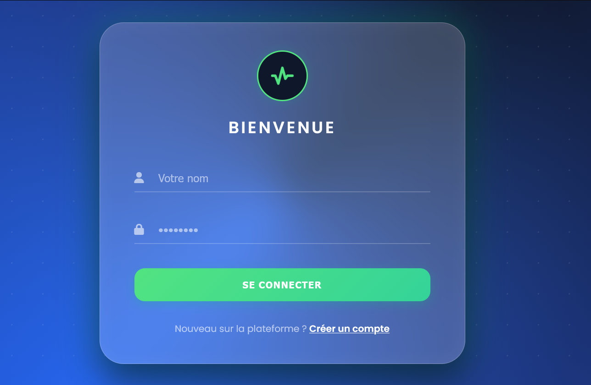
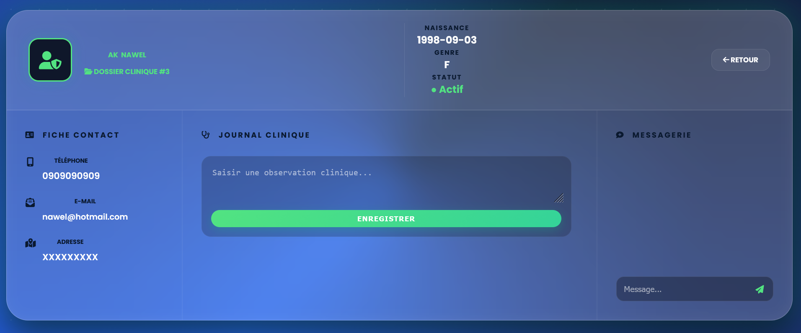
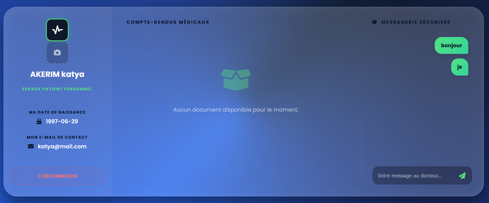
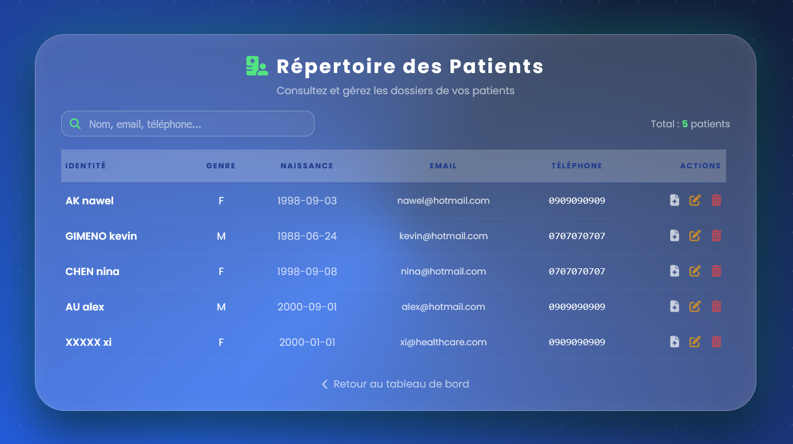
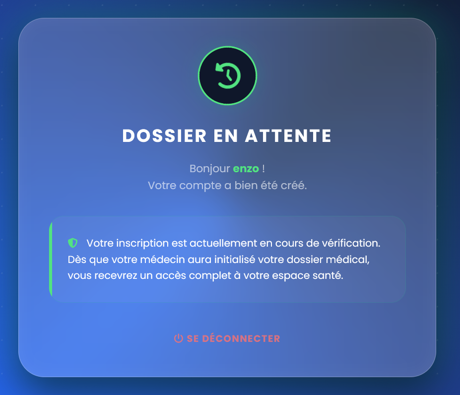
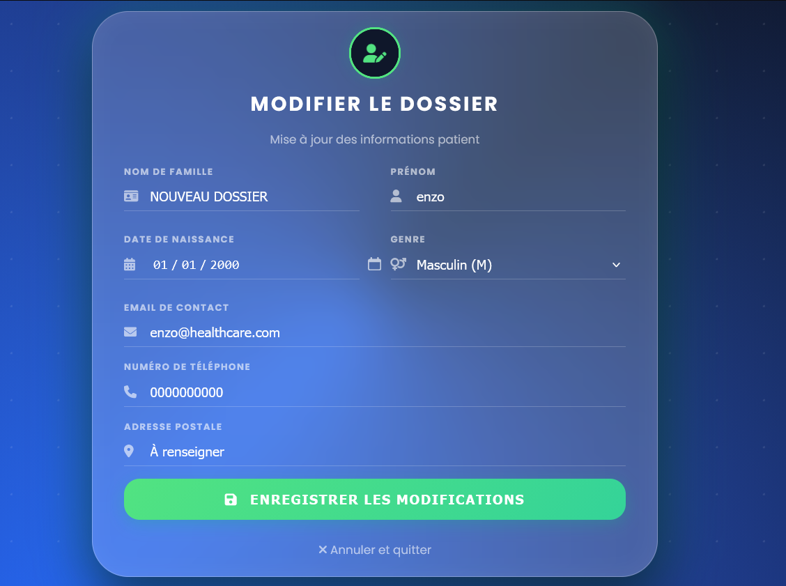

# Healthcare - Solution de Gestion Médicale Haute Performance

Ce projet est une application complète de suivi médical conçue autour d'une architecture **microservices**. Mon objectif était de créer un outil qui soit non seulement robuste techniquement (sécurité, scalabilité) mais aussi d'un niveau professionnel au niveau de l'interface (UX/UI).

## 🏥 Vision du Projet
J'ai conçu ce système pour séparer strictement les domaines métier afin de garantir une maintenance isolée et une haute disponibilité :
1.  **L'identité & Sécurité** (MySQL) : Gestion rigoureuse des comptes et des droits d'accès.
2.  **Le suivi clinique** (MongoDB) : Utilisation du NoSQL pour la flexibilité des notes médicales et des historiques.
3.  **L'expérience utilisateur** (Thymeleaf/CSS3) : Développement d'un "Design System" cohérent pour un rendu logiciel moderne.

## 🏗️ Architecture du Système
L'écosystème repose sur 5 microservices conteneurisés communiquant au sein d'un réseau Docker interne :

*   **Portail UI (8080)** : L'interface interactive. Elle orchestre les données et gère la logique de présentation.
*   **Config Server (8888)** : Centralisation des configurations de tous les services via un dépôt Git.
*   **Consul (8500)** : Annuaire du système (Service Discovery) et surveillance de l'état de santé des services (Healthcheck).
*   **Services Métier** :
    *   `User-Service` (MySQL) : Authentification, cryptage BCrypt et gestion des rôles.
    *   `Patient-Service` (MySQL) : Répertoire administratif et gestion des identités.
    *   `Note-Service` (MongoDB) : Gestion des dossiers médicaux, observations cliniques et messagerie sécurisée.

## 💎 Design System & UX
Pour ce projet, j'ai voulu m'éloigner des interfaces classiques pour proposer une expérience **"Premium"** inspirée des meilleurs logiciels SaaS de santé.

*   **Effet Glassmorphism** : Utilisation de flous directionnels (`backdrop-filter`) et de transparences pour une interface élégante qui ne fatigue pas l'œil.
*   **Palette Haute Définition** : Choix du **Bleu Obsidienne (#0a192f)** pour le sérieux institutionnel et du **Vert Médical (#10b981)** pour les actions et le dynamisme.
*   **Réactivité & Fluidité** :
    *   Intégration de filtres en temps réel (JavaScript Vanilla).
    *   Design "No-Zoom" parfaitement **Responsive (Mobile Friendly)**.
    *   Zones de défilement internes pour conserver l'intégrité visuelle des cartes.

### Aperçu de l'interface :
| Authentification Glassmorphism | Dashboard & Navigation |
|---|---|
|  |  |

| Dossier Patient (Workspace) | Répertoire & Recherche Live |
|---|---|
|  |  |

| Salle d'attente sécurisée | Formulaire Intelligent |
|---|---|
|  |  |

## 🛠️ Stack Technique

### Backend & Infrastructure
*   **Java 17 & Spring Boot 3** : Socle technologique moderne (Jakarta EE).
*   **OpenFeign** : Communication inter-services typée et performante.
*   **Spring Security 6** : Protection des routes par rôles (RBAC) et session sécurisée.
*   **Docker & Compose** : Conteneurisation totale pour un déploiement reproductible.

### Frontend & UI
*   **Thymeleaf** : Injection dynamique de données côté serveur (Natural Templates).
*   **CSS3 Modulaire** : Architecture segmentée par page pour éviter la dette technique.
*   **FontAwesome 6** : Bibliothèque d'icônes vectorielles pour une navigation intuitive.

### Stratégie de Données (Polyglot Persistence)
*   **MySQL** : Garantit l'intégrité des données relationnelles structurées.
*   **MongoDB** : Offre une flexibilité totale pour le contenu des notes cliniques et l'historique des échanges.

## 🧪 Qualité & Fiabilité
*   **Couverture de code à 100%** sur l'ensemble des microservices métier.
*   **Tests Unitaires & Mocking** (JUnit 5, Mockito).
*   **Tests d'Intégration** (Bases de données H2 et Embedded MongoDB).
*   **Validation UI/UX** : Tests d'accessibilité (contraste WCAG) et de responsivité sur plusieurs résolutions d'écran.

## 🚀 Installation & Lancement

1.  **Clonage** : `git clone https://github.com/Akh138/healthcare-project.git`
2.  **Compilation (depuis la racine)** :
    ```bash
    ./mvnw clean package -DskipTests
    ```
3.  **Déploiement Docker** :
    ```bash
    docker-compose up --build -d
    ```

### Accès au système
*   **Interface Utilisateur** : http://localhost:8080
*   **Annuaire des services (Consul)** : http://localhost:8500
*   **Identifiants Admin par défaut** : admin / 12345

---

## 💡 Note de fin & Retours d'expérience

Ce projet **Healthcare** marque une étape clé dans mon parcours de développeur. Si mes précédents projets m'ont permis de comprendre la mécanique des microservices, celui-ci m'a poussé à franchir un cap supérieur : celui de la **qualité produit**.

### Ce que j'ai appris de plus précieux :
*   **La rigueur du Design System** : J'ai appris qu'une application pro ne se contente pas de "marcher" ; elle doit être cohérente. Gérer le Glassmorphism, les ratios de contraste et la responsivité a été un défi aussi exigeant que la logique backend.
*   **La puissance de la donnée hybride** : Maîtriser la **Polyglot Persistence** (MySQL + MongoDB) m'a donné une vision stratégique sur la manière de structurer les données selon les besoins métier.
*   **L'exigence DevOps** : L'automatisation du build Docker et la gestion du réseau entre conteneurs ont été essentielles pour la fluidité du développement.

### Ma méthode de travail :
J'ai utilisé l'**IA comme un "Senior Mentor"**. Elle a été mon binôme pour critiquer mes choix d'interface, m'aider à architecturer mon CSS de façon modulaire et m'accompagner dans la validation QA. Cette collaboration m'a permis de me concentrer sur la vision globale et d'assurer une finition de niveau professionnel.

Aujourd'hui, je suis capable de **piloter la création d'une application distribuée de A à Z**, de l'infrastructure jusqu'à l'expérience finale de l'utilisateur.

---
**Habib (Akh138)**  
*Développeur Fullstack Java / Spring Boot*